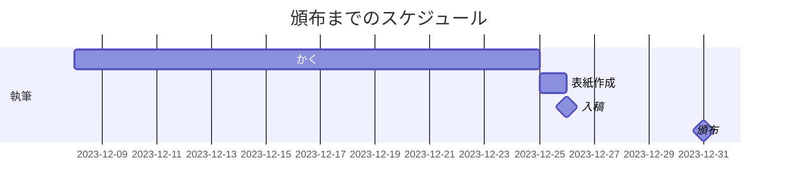

# 0から始める数理論理学入門

## リポジトリの概要

本リポジトリは，コミックマーケット103で頒布する新刊『0から始める数理論理学入門』の
原稿を格納したリポジトリである．

書き始めから執筆後に至るまでつねにこのリポジトリはパブリックに設定している．なお，執筆中にPDFファイルもリポジトリに含めるかどうかは検討中である．

## 配置場所

日曜日東地区ぺ36a

Webカタログは[こちら](https://webcatalog.circle.ms/Perma/Circle/10364924/)

## 対象読者

以下の条件のいずれかに当てはまるような人が対象読者である：

+ 数学についてはそれなりに学んでいるが，数理論理学については何も知らない
+ 「物理数学」に代表されるようなラフな形でしか数学を学んだことがない．

すでに数理論理学をそれなりに学んでいる人は，本書を読んでも得るものはあまり多くはないであろう．
また，数理論理学が数学の一分野である以上，
（高校や大学の入学試験用でないという意味で）一般向けの数学の本でよく使われる言い回しや議論のスタイルについてはある程度慣れておくことが望ましい．

さらに，群論や順序集合といった理論についてある程度学んだことがあればより本書の内容が親しみやすく感じるであろう．

## 頒布物の概要

数理論理学は，ゲーデルの不完全性定理の存在もあってか世間一般の認知度は比較的高い．しかしながら，数理論理学の基本コンセプトである「論理を形式化してその性質を探っていく」という考え方は広く浸透しているとはいいがたい．
特にゲーデルの不完全性定理は，なんとなく日常用語として理解できそうな言い回しや字面のインパクトの強さからか
「ゲーデルは数学が万能とはなりえないことを証明した」だの「完璧な数学理論は存在しない」だのと意味不明な誤解が発生しがちである．
とはいえ，最近では「これは誤解である」という認識自体は広まっており，状況は改善しつつあるといえる．

一方で，いわゆる「通常の数学理論」と比較すると数理論理学はあまり広く学ばれてはいないのが現状である．
現在ではわかりやすい和書も多数出版されており，学ぶハードルはそれなりに低いけども，学んでいる人の数はほかの数学理論と比較すれば少ないと言わざるを得ないのではないだろうか．
実際，数学をそれなりに学んでいる人であっても数理論理学については何も知らないという人が少なくない．数学を専門とせず，道具として使っている物理学や統計学を学んでいる人であればなおさらである．

しかし，特に数学を学んでいる人にとっては「論理記号」については身近だと感じる人は多い．彼らにとって論理記号は普段使っている数学記号と同じく「なんらかの数学的主張を表現したもの」であり，
その認識のままで大きな問題が生じることはない．
むろん数理論理学を学んだ人からすればその認識は厳密には誤りである．
誤っている部分が数理論理学にとっても些事であればよいのだが，残念なことに論理を形式化するという数理論理学の基本的な方法について理解できていない致命的な誤りである．

本書はそのような誤解を払拭することを第一の目標とした．
すなわち「論理を形式化する」ことがいったいどういうことなのかを実感をもって学ぶことが目標である．
そのため，入門書で多く取り上げられているであろう数理論理学に関する結果の多くは取り上げない．
特に不完全性定理については取り上げないので，それをめあてにして本書を手に取るとがっかりするであろう．その代わり，通常の数学理論との接点を多く紹介することで「論理の形式化」についての理解を深めたい．

とりわけ「$`A \land B`$は$`A`$かつ$`B`$という意味」**ではない**というジャーゴンの意味が理解できれば目標達成である．
このことが理解できれば，数理論理学の世界に飛び込む準備は完全に整ったといってよい．要するに，本書は数理論理学入門の前段階という位置づけで活用するとよい．

## スケジュール

## Todo

+ [x] 印刷所に予約注文して締め切りを確定させる
+ [x] WSL環境を見直す
+ [x] リポジトリのディレクトリ構成を確定させる
+ [x] `Dockerfile`か`docker-compose.yml`を作成する
+ [x] `llmk.toml`を作成する
+ [x] 各章の内容を取り込むマスタとなる`.tex`ファイルを作成する
+ [ ] 目次を作成する
+ [ ] ユーザー定義コマンドを作る
+ [x] 索引を作れるようにしておく
+ [x] 奥付を作る
+ [ ] かく
+ [ ] 表紙を作る
+ [ ] 入稿する